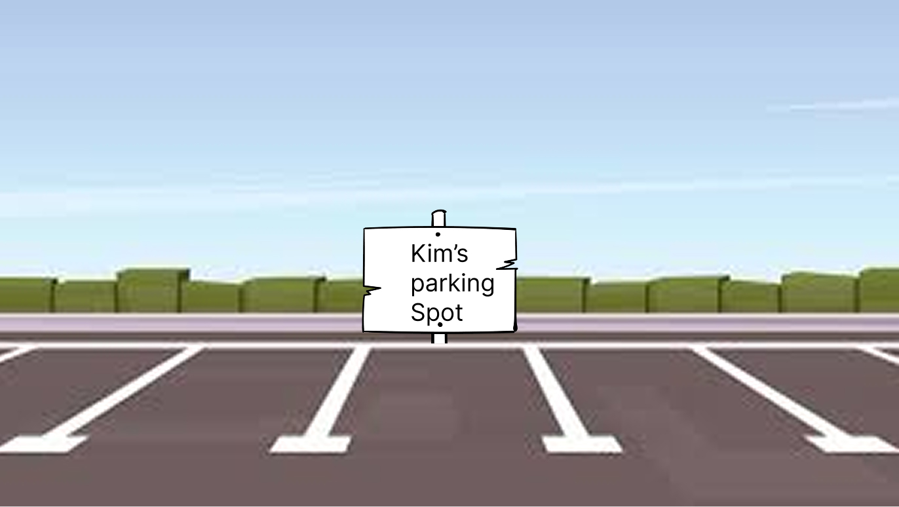

# Journal Entry DOET: Chapter 4 Knowing What to Do

Because I’m a visual learner and remember concepts best when I can see them, I plan to use images in this journal entry to represent my understanding of the key themes from Chapter 4. This chapter focuses on how good design makes actions clear through discoverability, signifiers, constraints, feedback, and natural mapping. Using visuals will help me show how these concepts work together to make everyday objects easier to understand and use.

### Knowledge in the World (Maps & Navigation Systems)
  

### Constraints let’s people determine the proper course of action
## Four kinds of Constraints 

### Logical & Physical (Puzzle)
Physical limitations constrain proper operations and need to be easy to see and interpret
(A puzzle with one missing piece)

  

### Cultural 
What actions are socially & privately acceptable
(Eating utensils can be country specific)

  

### Semantic
what meaning the situation gives about what to do
(An assigned parking space with a persons name on it)

  

## Discoverability & Signifiers
Designing things so users know what actions are possible and how to do them
(chairs placed by the lake)

  

## Feedback
User receives clear information about what happened when an action is taken
(a child blowing a pinwheel, what happens?)

  

## Natural Mapping
Controls and displays should be arranged in ways that match users’
(touch screen volume display, with signifiers indicating softer or louder)

  

## Forcing Functions / Lock-in / Lock-out
Strong constraints or design choices that force a correct action or prevent incorrect ones
(a cockpit door barring unauthorized users (lock out), Save changes before leavin your document (lock in) app onboarding (forced function))

  

## Change & Conventions
Even when a new design is better, if it breaks familiar conventions it can confuse users; switching from old norms requires coordination or clear cues
(Ignition to start a car (old vs new))

  
